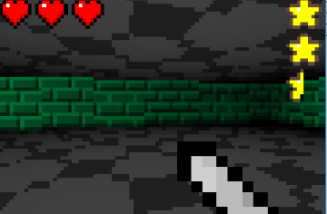

# Jin 
[中文](README_zh.md)   
A game framework for making 2D games in lua. 

## Screenshot   
   
   
   

## Modules   
* Graphics 
* Filesystem 
* Keyboard 
* Mouse 
* Timer 
* Audio[WIP]
* Network[WIP]

## License
See [LICENSE](LICENSE) for details.

