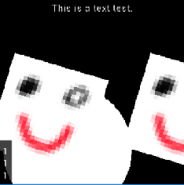
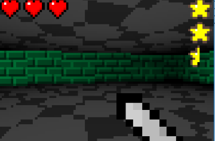
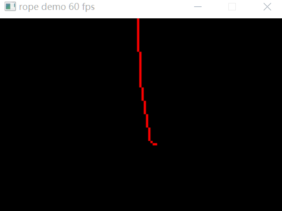

# Jin 

一个用于制作lua 2d游戏的游戏框架。

## 截图   
 
 
 

## 指南    
你可以在[发布页面](https://github.com/neonum/jin/releases)下载可执行文件。 为了运行
游戏，你需要把第一个参数设为你的游戏目录。比如，你的游戏放在一个文件夹`mygame`之下，必须
运行一下命令:     

```batch    
jin mygame
```    
    
如果你想开启debug模式，需要将第二个参数设置为`-d`。 你需要在游戏目录下创建一个 `main.lua` 文件
来作为游戏入口。如果你想配置游戏的窗口大小，帧率，标题，你还需要创建一个 `config.lua` 文件。
 `config.lua` 类似以下形式：     

```lua     
return{
    width  = 512, 
    height = 512, 
    fps    = 60, 
    title  = "my title"
}
```
    
你需要在 `main.lua` 中定义四个函数，他们分别是：        

```lua     
jin.core.load()       -- run before game loop 
jin.core.onEvent(e)   -- called every event loop 
jin.core.onUpdate(dt) -- called every frame 
jin.core.onDraw()     -- called every frame 
```

以下是一个小例子，在屏幕上绘制圆形并打印hello,world: 

```lua 
function jin.core.onEvent(e) 
    if e.type == "quit" then 
        jin.core.quit() 
    end 
end 

function jin.core.onDraw() 
    jin.graphics.circle("fill", 10, 10, 20)
    jin.graphics.write("hello, world", 100, 100, 16, 1, 20)
end 
```

API参见 [doc/api.md](doc/api.md) .

## 模块   
* 图形 
* 文件系统 
* 键盘输入 
* 鼠标输入 
* 计时器 
* 音频[WIP]
* 网络支持[WIP]

## 许可证
详见 [LICENSE](LICENSE)。


